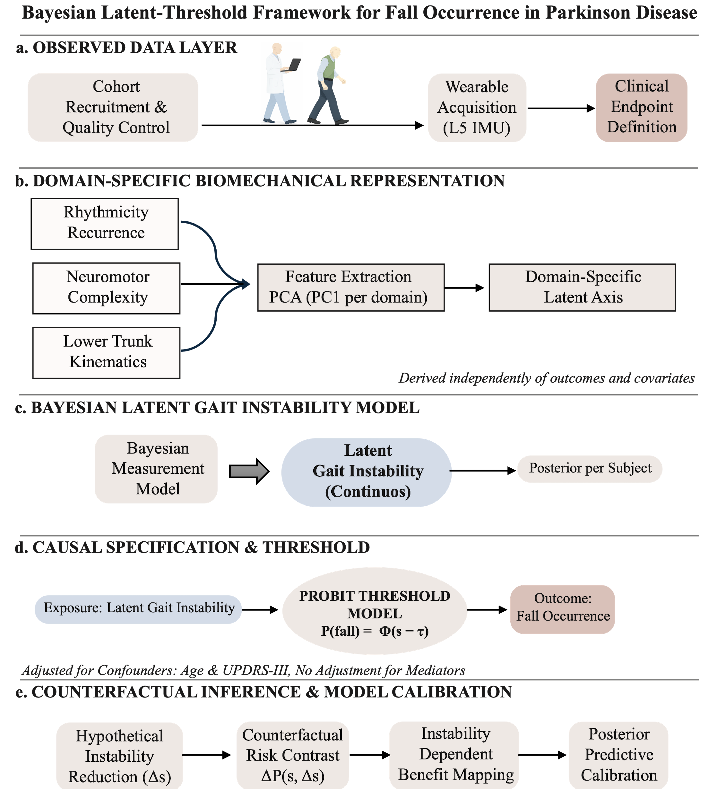
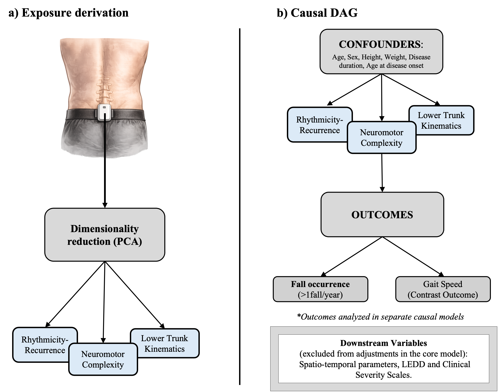

# LatentGait

## Latent gait instability underlying falls occurrence in Parkinson’s disease

A **Bayesian latent-variable framework** for identifying biomechanical instability and **threshold-based fall susceptibility** from wearable trunk accelerations.



**Figure 1.** Conceptual and analytical framework of the Bayesian latent-threshold model for fall occurrence in Parkinson’s disease.

---

## Overview

Falls in Parkinson’s disease (PD) are commonly interpreted as downstream consequences of global clinical severity or isolated gait impairments.  
This study adopts a different perspective: fall occurrence is modeled as the manifestation of an **underlying latent gait instability process** inferred from wearable trunk biomechanics.

> Falls emerge when a latent gait instability process crosses a probabilistic threshold.

Using trunk accelerometry recorded during walking, the analytical pipeline:

1. derives domain-specific biomechanical representations from wearable signals  
2. reduces each domain into an interpretable latent axis  
3. integrates these axes within a Bayesian latent-variable model  
4. estimates subject-specific latent gait instability with explicit uncertainty  
5. models fall occurrence as a threshold-dependent probabilistic event  
6. quantifies counterfactual reductions in fall probability under hypothetical improvements in instability :contentReference[oaicite:3]{index=3}

This repository contains the computational workflow underlying the study.

---

## Key Contributions

- Causal role specification using an explicit DAG
- Domain-structured biomechanical representation of trunk dynamics
- Bayesian latent-variable modeling of gait instability
- Explicit propagation of measurement uncertainty
- Threshold-based probabilistic modeling of fall occurrence
- Counterfactual estimation of instability-dependent fall-risk reduction

---

## Conceptual Framework

The core hypothesis is that falls do not arise directly from any single observed gait metric. Instead, they emerge when a continuous latent instability process crosses a probabilistic threshold. This framing separates biomechanical structure from downstream clinical manifestation and supports uncertainty-aware inference at the individual level. :contentReference[oaicite:4]{index=4}



**Figure 2.** Exposure derivation and causal structure of the analytical framework. Latent gait-related exposures are derived from trunk biomechanical domains and embedded within a causal DAG specifying confounders and downstream variables.

Key conceptual points:

- Falls are modeled as **thresholded manifestations** of latent gait instability  
- Trunk-derived biomechanical domains are treated as **indicators of an underlying instability construct**  
- Downstream functional and clinical variables are not used to define the exposure itself  
- Uncertainty in latent instability is explicitly propagated into downstream fall models :contentReference[oaicite:5]{index=5}

---

## Methods Summary

### 1. Domain-specific biomechanical representation

Trunk acceleration features are grouped a priori into three physiologically grounded domains:

- **Rhythmicity and recurrence**
- **Neuromotor complexity**
- **Lower trunk kinematics**

Principal component analysis (PCA) is applied separately within each domain, and the first principal component is retained to define a scale-normalized latent axis for that domain. This domain-wise strategy preserves interpretability and avoids mixing mathematically heterogeneous gait descriptors in a single undifferentiated reduction step. :contentReference[oaicite:6]{index=6}

### 2. Bayesian latent gait instability model

The three domain-specific axes are then integrated within a Bayesian hierarchical latent-variable model. This yields a continuous subject-level latent gait instability estimate together with participant-specific posterior uncertainty. Lower trunk kinematics is used as the anchoring indicator for model identification, while the remaining domains contribute probabilistically to the shared latent construct. 

### 3. Contrast analysis with gait speed

As a functional contrast, gait speed is modeled separately to verify whether conventional spatiotemporal outcomes exhibit the same structural properties as latent instability. In the supplementary analysis, gait speed shows limited explanatory power and does not display threshold-like organization, supporting the interpretation that the main threshold behavior is specific to the latent instability framework rather than a generic property of gait measures. :contentReference[oaicite:8]{index=8}

### 4. Bayesian fall-occurrence model

Latent gait instability is related to fall occurrence through a Bayesian logistic model to assess preliminary monotonic association. This step evaluates whether increasing latent instability is associated with increasing posterior probability of falling, while accounting for covariates and measurement uncertainty. 

---

## Threshold Model and Counterfactual Inference

The central contribution of the study is the Bayesian probit threshold formulation of fall occurrence. Under this model, fall probability is a smooth but sharply transitioning function of latent gait instability, with a threshold parameter τ defining the instability level at which fall probability crosses 50%. The model identifies low-risk, transition, and high-risk regimes along the latent instability continuum. :contentReference[oaicite:10]{index=10}


**Figure 3.** Threshold-based organization of fall risk along the latent gait instability continuum and counterfactual fall-risk reduction under hypothetical improvements in instability.

This framework also enables **counterfactual benefit mapping**. Hypothetical reductions in latent instability are propagated through the posterior threshold model to estimate absolute changes in fall probability. The analysis shows that the largest expected benefit is concentrated near the inferred transition zone, whereas gains are attenuated at the lowest and highest ends of the instability spectrum. :contentReference[oaicite:11]{index=11}

---

## Repository Structure

```text
notebooks/
├── 01_exposure_definition_and_causal_roles.ipynb
├── 02_latent_trunk_axes.ipynb
├── 03_spatiotemporal_latent_gait_instability.ipynb
├── 04_contrast_gait_speed.ipynb
├── 05_bayesian_latent_gait_instability_and_falls_occurrence.ipynb
└── 06_threshold_counterfactual_falls.ipynb
```

- **01_exposure_definition_and_causal_roles.ipynb**
Defines the causal structure of the study, including exposures, outcomes, confounders, and forbidden adjustments.

- **02_latent_trunk_axes.ipynb**
Builds the domain-specific latent biomechanical axes from trunk-derived gait features using PCA.

- **03_spatiotemporal_latent_gait_instability.ipynb**
Implements the Bayesian latent-variable model used to infer subject-specific latent gait instability.

- **04_contrast_gait_speed.ipynb**
Performs the contrast analysis showing the limited explanatory role of gait speed as a standalone outcome.

- **05_bayesian_latent_gait_instability_and_falls_occurrence.ipynb**
Fits the Bayesian model linking latent gait instability to fall occurrence.

- **06_threshold_counterfactual_falls.ipynb**
Implements the probit threshold model and the counterfactual fall-risk reduction analyses.

## Methodological Contributions

Causal role specification guided by an explicit DAG
Domain-specific dimensionality reduction of wearable trunk biomechanics
Bayesian latent-variable modeling of gait instability
Propagation of latent measurement uncertainty into downstream inference
Threshold-based probabilistic modeling of fall occurrence
Counterfactual estimation of instability-dependent fall-risk reduction

## Installation

Create the conda environment:

```bash
conda env create -f environment.yml
conda activate latent-gait
jupyter lab
Data Availability
```

---

Clinical datasets used in this study are not publicly distributed in this repository due to ethical and privacy restrictions.

The repository provides the complete analytical workflow, but users must supply their own datasets with equivalent structure to reproduce the analysis.

Expected inputs include subject-level clinical variables and processed biomechanical domain representations compatible with the notebooks in this repository.

## Reproducibility

The pipeline relies primarily on:

PyMC for Bayesian inference
ArviZ for posterior diagnostics and summarization
scikit-learn for preprocessing and dimensionality reduction
statsmodels for contrast analyses
pandas / NumPy / matplotlib / seaborn for data handling and visualization

Random seeds are fixed where appropriate to support reproducibility.

## Citation

If you use this repository or build upon this framework, please cite:
Trabassi D, Castiglia SF, De Icco R, Tassorelli C, Serrao M.
**Latent gait instability underlying falls occurrence in Parkinson’s disease.**

Bibliographic details will be updated upon publication.

## License
This repository is released under the MIT License.